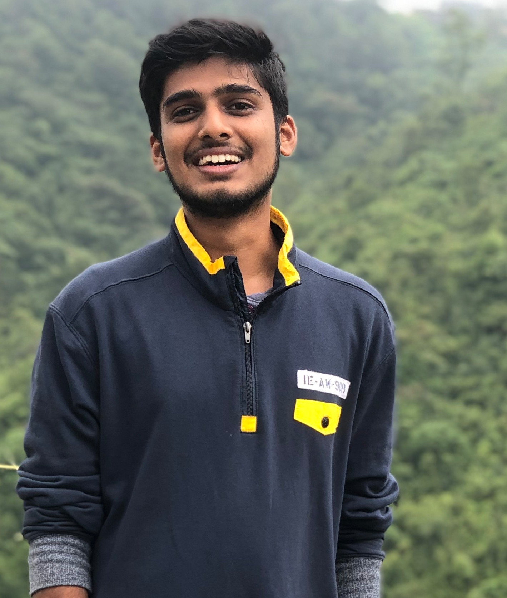

## Table of Contents
- [Publications](./publications.md)
- [Patents](./patents.md)
- [Projects](./projects.md)

## Career Updates
- Jan 2025 - Senior Software Engineer (Perception) at [Latitude AI](https://lat.ai/)
- 2025 - Paper review at [CVPR 2025](https://cvpr.thecvf.com/Conferences/2025), [AAAI 2025](https://aaai.org/conference/aaai/aaai-25/)
- 2024 - Paper review at [CVPR 2024](https://cvpr.thecvf.com/Conferences/2024), [ECCV 2024](https://eccv.ecva.net/Conferences/2024), [ICRA 2024](https://2024.ieee-icra.org/), [IROS 2024](https://ieee-iros.org/)
- 2023 - Paper review at [IROS 2023](https://ieee-iros.org/)
- Apr 2023 - Senior Perception Research Engineer at [Ford Motor Company](https://www.ford.com/)
- 2022 - Paper review at [ICRA 2022](https://ewh.ieee.org/soc/ras/conf/fullysponsored/icra/2022/icra2022.org/index.html)
- Dec 2022 - Session chair at 3rd Ford AI/ML Conference 2022
- Jul 2021 - Perception Reserach Engineer at [Ford Motor Company](https://www.ford.com/)
- Jun 2021 - Graduated from [UC San Diego](https://ucsd.edu/)
- Mar 2021 - Artificial Intelligence intern at [Jabra](https://www.jabra.com/business/video-conferencing)
- 2020 ~ 2021 - Graduate teaching assistant for various courses at UC San Diego
- Jun 2020 - Artificial Intelligence intern at [Jabra](https://www.jabra.com/business/video-conferencing)
- Oct 2019 - Graduate student researcher at [CHEI lab](https://chei.ucsd.edu/), UC San Diego
- Sept 2019 - Joined [UC San Diego](https://ucsd.edu/) (M.S in Robotics)
- Jul 2018 - Systems/Software Engineer at [Hewlett Packard Enterprise](https://www.hpe.com/us/en/home.html)
- May 2018 - Graduated from J.S.S University, Mysuru, India
- Jan 2018 - Intern at Hewlett Packard Enterprise
- Aug 2017 - Computer Vision intern at Vigyan Labs Innovation
- Jun 2017 - Finalists at Texas India Innovation Challenge 2017. [video](https://youtu.be/V2Wcln0M9FM)
- Aug 2014 - Joined [J.S.S University](https://jssstuniv.in/) (B.E in Electronics and Communication)

